# Homework2 (report)

**Student:** Nguyễn Tấn Phước
**ID:** 23127536

---

## Table of Contents

1. [Lab 01 — User and Group Onboarding](#lab-01--user-and-group-onboarding)
2. [Lab 02 — `usermod`, Group Modification, and Account Locking](#lab-02--usermod-group-modification-and-account-locking)
3. [Lab 03 — Linux Permissions, `chmod`, `chown`, and `umask`](#lab-03--linux-permissions-chmod-chown-and-umask)
4. [Lab 04 — SUID, SGID, and Sticky Bit](#lab-04--suid-sgid-and-sticky-bit)
5. [Lab 05 — Access Control Lists](#lab-05--access-control-lists)
6. [Lab 06 — Least-Privilege Sudoers Policy](#lab-06--least-privilege-sudoers-policy)
7. [Lab 07 — Incident Response and Account Containment](#lab-07--incident-response-and-account-containment)
8. [Lab 08 — Surviving SSH Disconnections with `tmux`](#lab-08--surviving-ssh-disconnections-with-tmux)
9. [Lab 09 — Process Diagnosis and Control](#lab-09--process-diagnosis-and-control)
10. [Lab 10 — Capstone: Hardened Multi-Role Development Server](#lab-10--capstone-hardened-multi-role-development-server)
11. [Conclusion](#conclusion)

---

# Lab 01 — User and Group Onboarding

## Objective

The objective of this lab was to create Linux users and groups from scratch for a new project team. The team had two main roles: developers and operations. Developers included `alice` and `bob`, while operations included `carol` and `dave`. The lab also introduced the difference between normal users and system users by creating a service account named `svcapp`.

## Commands Used

```bash
sudo groupadd dev
sudo groupadd ops

grep -E "^dev:|^ops:" /etc/group

sudo useradd -m -s /bin/bash -c "Dev User" -G dev alice
sudo passwd alice

sudo useradd -m -s /bin/bash -c "Dev User" -G dev bob
sudo passwd bob

sudo useradd -m -s /bin/bash -c "Ops User" -G ops carol
sudo passwd carol

sudo useradd -m -s /bin/bash -c "Ops User" -G ops dave
sudo passwd dave

id alice
id carol

grep alice /etc/passwd

sudo useradd -r -s /usr/sbin/nologin svcapp

grep -E "alice|bob|carol|dave|svcapp" /etc/passwd
```

## Explanation of `id alice` and `id carol`

The command `id alice` shows Alice's UID, primary GID, and supplementary groups. For example, the output has this structure:

```text
uid=1001(alice) gid=1003(alice) groups=1003(alice),1001(dev)
```

The `uid` is the user ID of Alice. The `gid` is Alice's primary group ID. The `groups` field lists all groups that Alice belongs to, including her primary group and supplementary groups. Since Alice was added to the `dev` group using `-G dev`, `dev` appears as one of her supplementary groups.

The command `id carol` works the same way. Carol belongs to her own primary group and the supplementary group `ops`.

## Seven Fields of Alice's `/etc/passwd` Entry

Alice's `/etc/passwd` entry has this general structure:

```text
alice:x:1001:1003:Dev User:/home/alice:/bin/bash
```

The seven colon-separated fields are:

| Field Number | Example       | Meaning                                                                 |
| -----------: | ------------- | ----------------------------------------------------------------------- |
|            1 | `alice`       | Username used for login                                                 |
|            2 | `x`           | Password placeholder; the real password hash is stored in `/etc/shadow` |
|            3 | `1001`        | UID, the numeric user ID                                                |
|            4 | `1003`        | Primary GID, the numeric primary group ID                               |
|            5 | `Dev User`    | GECOS/comment field describing the user                                 |
|            6 | `/home/alice` | Home directory                                                          |
|            7 | `/bin/bash`   | Login shell                                                             |

## Why `svcapp` Gets a UID Below 1000

The user `svcapp` was created using:

```bash
sudo useradd -r -s /usr/sbin/nologin svcapp
```

The `-r` option creates a system user. On Ubuntu, normal human users usually receive UIDs starting from 1000 or higher, while system users usually receive lower UIDs. The reason is that system users are intended to run services or background processes, not to log in interactively. The `/usr/sbin/nologin` shell further prevents normal interactive login.

## Screenshots

### All created users in `/etc/passwd`

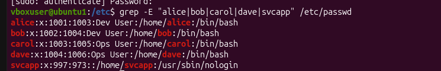

### User ID and group membership output

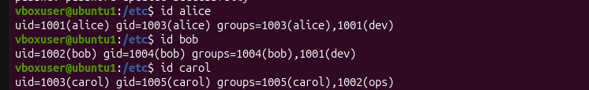

---

# Lab 02 — `usermod`, Group Modification, and Account Locking

## Objective

The objective of this lab was to understand how Linux modifies user group membership using `usermod`, especially the silent danger of using `-G` without `-a`. The lab also demonstrated how account locking appears in `/etc/shadow`.

## Commands Used

```bash
sudo usermod -aG dev,docker,sudo alice
id alice

sudo usermod -G qa alice
id alice

sudo usermod -G dev,docker,sudo,qa alice
id alice

su - alice
groups
newgrp dev
exit

sudo usermod -L alice
sudo grep alice /etc/shadow

sudo usermod -U alice
sudo grep alice /etc/shadow
```

## Difference Between `-g`, `-G`, and `-aG`

The lowercase `-g` option changes a user's primary group. The primary group is the default group assigned to new files created by that user.

The uppercase `-G` option sets the full supplementary group list. It replaces all existing supplementary groups with the groups listed in the command. Therefore, running `usermod -G qa alice` removes Alice from previous groups such as `dev`, `docker`, and `sudo`.

The combined `-aG` option appends groups to the existing supplementary group list. This is the safer option when adding a user to a new group because it does not remove existing groups.

## Real-World Risk of Losing `sudo`

If Alice had production administrator access and accidentally lost the `sudo` group, she would no longer be able to escalate privileges during an incident. This could cause a serious outage if she needed to restart services, inspect protected logs, fix permissions, or deploy an emergency patch. The danger is that `usermod -G` produces no warning when it removes previous groups.

## Screenshots

### Alice before account lock

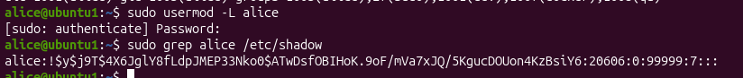

### Alice after account lock

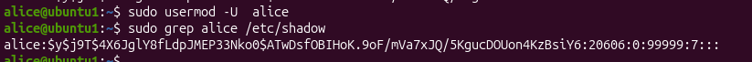

### Alice ID output

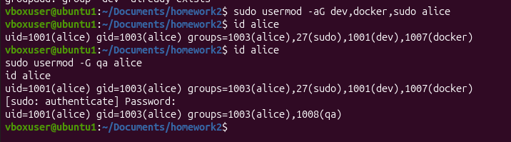

---

# Lab 03 — Linux Permissions, `chmod`, `chown`, and `umask`

## Objective

The objective of this lab was to understand standard Linux permission bits, ownership, `chmod`, `chown`, and `umask`. The lab also demonstrated Linux permission evaluation order using users from different groups.

## Commands Used

```bash
touch secret.txt
mkdir reports
ls -la
umask

chmod 600 secret.txt
chmod 750 reports

chmod u+x,o-rwx,g=rx reports

sudo chown -R alice:dev reports
ls -la
ls -ld reports

umask 027
touch newfile.txt
mkdir newdir
ls -la newfile.txt newdir
```

## Octal Permission Explanation

### `600`

```text
600 = rw-------
```

| Digit | Target | Permission |
| ----: | ------ | ---------- |
|   `6` | owner  | `rw-`      |
|   `0` | group  | `---`      |
|   `0` | others | `---`      |

Only the owner can read and write the file.

### `750`

```text
750 = rwxr-x---
```

| Digit | Target | Permission |
| ----: | ------ | ---------- |
|   `7` | owner  | `rwx`      |
|   `5` | group  | `r-x`      |
|   `0` | others | `---`      |

The owner has full access. The group can read and enter the directory but cannot write. Others have no access.

## `umask 027`

For a new file, Linux starts from base permission `666`.

```text
666 - 027 = 640
```

So a new file receives:

```text
rw-r-----
```

For a new directory, Linux starts from base permission `777`.

```text
777 - 027 = 750
```

So a new directory receives:

```text
rwxr-x---
```

## Permission Evaluation for Bob and Dave

Linux checks permissions in this order:

1. If the process is root, access is granted.
2. If the process UID matches the file owner, owner bits are used.
3. If the process belongs to the file group, group bits are used.
4. Otherwise, other bits are used.

For a file owned by `alice:dev` with permission `640`, Bob can read it if he belongs to the `dev` group. He is not root and not the owner, but he matches the file group, so Linux applies the group bits `r--`. Since `r--` includes read permission, Bob can read the file.

Dave cannot read the same file if he belongs only to the `ops` group. He is not root, not the owner, and not a member of the file's group `dev`. Therefore, Linux applies the other bits `---`, which grant no access. Dave receives `Permission denied`.

## Screenshots

### Default and changed ownership/permissions

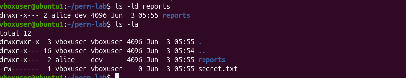

### `umask 027` result

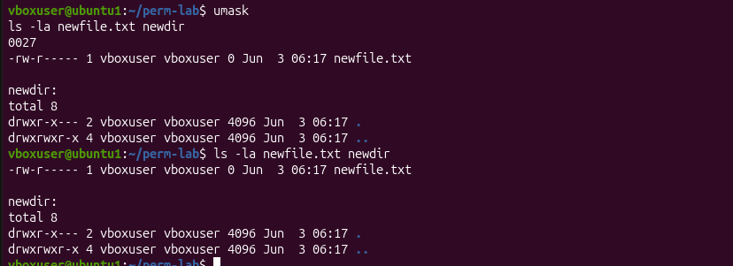

---

# Lab 04 — SUID, SGID, and Sticky Bit

## Objective

The objective of this lab was to understand Linux special permission bits: SUID, SGID, and sticky bit. The lab focused on a shared directory where files should inherit the `dev` group and where users should not be able to delete other users' files.

## Commands Used

```bash
sudo mkdir -p /opt/teamshared
sudo chown root:dev /opt/teamshared
sudo chmod 3775 /opt/teamshared
ls -ld /opt/teamshared

su - alice
echo "File created by alice" > /opt/teamshared/alice-file.txt
exit

su - bob
rm /opt/teamshared/alice-file.txt
exit

sudo chmod -t /opt/teamshared
sudo chmod +t /opt/teamshared

find / -perm -4000 2>/dev/null
```

## Explanation of `3775`

```text
3775 = SGID + sticky bit + rwxrwxr-x
```

The leading `3` means:

```text
3 = 2 + 1 = SGID + sticky bit
```

| Special Bit | Octal Value | Meaning                                                                 |
| ----------- | ----------: | ----------------------------------------------------------------------- |
| SUID        |         `4` | Run executable with the owner identity                                  |
| SGID        |         `2` | On a directory, new files inherit the directory group                   |
| Sticky bit  |         `1` | Prevent users from deleting files owned by others in a shared directory |

With mode `3775`, `/opt/teamshared` appears as:

```text
drwxrwsr-t
```

The `s` in the group execute position indicates SGID. The `t` in the others execute position indicates sticky bit.

## Sticky Bit Behavior

When sticky bit is enabled, Bob cannot delete Alice's file even though the directory is group-writable. After the sticky bit is removed using `chmod -t`, Bob can delete Alice's file because he belongs to the group that has write access to the directory.

## Why SUID on `/bin/bash` Is Dangerous

SUID on `/bin/bash` would be a critical security vulnerability because Bash is an interactive shell. If Bash were owned by root and marked SUID, a normal user could potentially start a shell with root-level effective privileges. That would bypass normal privilege boundaries and could allow the user to read protected files, modify system configuration, create persistence, disable security controls, or tamper with logs. For this reason, SUID should be used only for carefully designed binaries such as `/usr/bin/passwd`, not for general-purpose shells.

## Screenshots

### SGID and sticky bit on `/opt/teamshared`

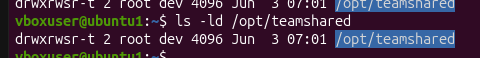

### Bob failed to delete Alice's file

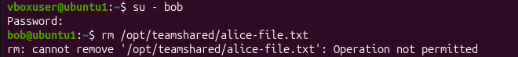

### SUID binary search

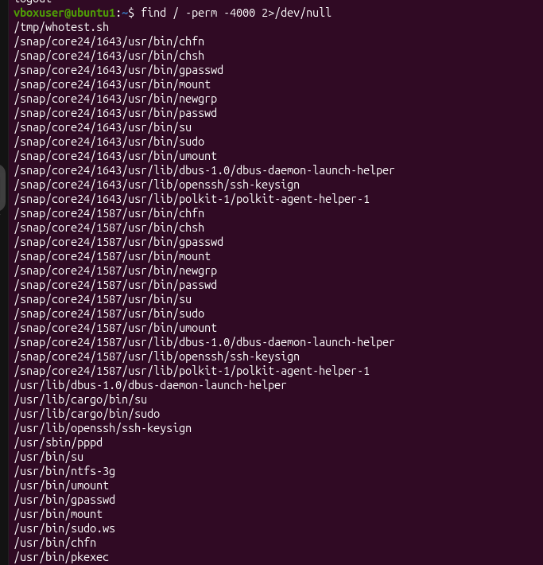

---

# Lab 05 — Access Control Lists

## Objective

The objective of this lab was to use ACLs to implement permissions that standard `chmod` cannot express. The project directory needed different permissions for the `dev` group, the `ops` group, and an individual contractor named `charlie`.

## Commands Used

```bash
sudo useradd -m -s /bin/bash -c "Contractor User" charlie

sudo mkdir -p /opt/project
sudo chown root:dev /opt/project
sudo chmod 770 /opt/project

sudo setfacl -m g:dev:rwx,g:ops:r-x,u:charlie:r-x /opt/project
sudo setfacl -d -m g:dev:rwx,g:ops:r-x,u:charlie:r-x /opt/project

getfacl /opt/project
ls -ld /opt/project

sudo chmod g-x /opt/project
getfacl /opt/project

sudo chmod g+x /opt/project
sudo setfacl -x u:charlie /opt/project
sudo setfacl -x d:u:charlie /opt/project
```

## ACL Mask Explanation

The ACL mask defines the maximum effective permissions for named users, named groups, and the owning group entry. It acts like a permission ceiling.

Before the mask trap, the directory had:

```text
mask::rwx
```

After running:

```bash
chmod g-x /opt/project
```

the ACL mask changed to:

```text
mask::rw-
```

This silently removed execute permission from effective ACL permissions. For example, `user:charlie:r-x` became effectively `r--`. On directories, losing execute permission is important because execute is required to enter or traverse the directory.

## When to Use ACLs Instead of Standard `chmod`

ACLs should be used when the standard owner/group/others model is not detailed enough. They are useful when multiple groups need different permissions, when a specific user needs special access without joining a group, or when inherited default permissions are required for new files and subdirectories.

## Screenshots

### Full ACL and default ACL

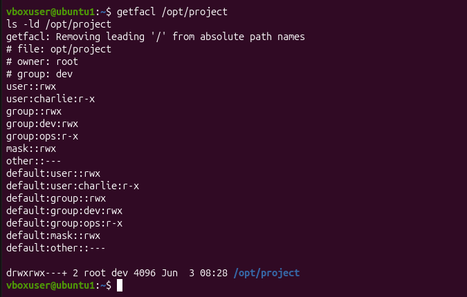

### ACL mask trap before and after `chmod g-x`

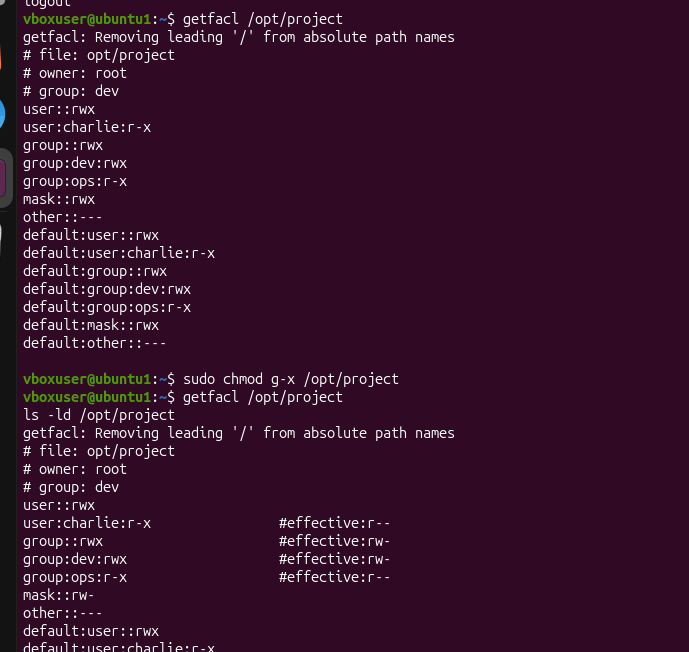

---

# Lab 06 — Least-Privilege Sudoers Policy

## Objective

The objective of this lab was to configure limited sudo access for an automated deployment account. The `deploy` user needed to run only a deployment script and restart the cron service, not receive full root access.

## Commands Used

```bash
sudo useradd -r -s /usr/sbin/nologin deploy

sudo mkdir -p /opt/scripts
sudo tee /opt/scripts/deploy.sh > /dev/null << 'EOF'
#!/bin/bash
echo "Deploying application..."
EOF

sudo chown root:dev /opt/scripts/deploy.sh
sudo chmod 750 /opt/scripts/deploy.sh

sudo visudo -f /etc/sudoers.d/deploy
```

## Sudoers Rule

```sudoers
deploy ALL=(root) NOPASSWD: /opt/scripts/deploy.sh, /bin/systemctl restart cron
```

If the system uses `/usr/bin/systemctl`, then the rule must use that exact path:

```sudoers
deploy ALL=(root) NOPASSWD: /opt/scripts/deploy.sh, /usr/bin/systemctl restart cron
```

## Why Use `/etc/sudoers.d/`

Using separate files in `/etc/sudoers.d/` is safer and cleaner than editing the main `/etc/sudoers` file directly. It keeps service-specific privilege rules modular, easier to audit, and easier to remove. The file should still be edited using `visudo -f` because `visudo` validates syntax before saving.

## Risk of `NOPASSWD: ALL`

Granting `NOPASSWD: ALL` to a service account is dangerous because it gives that account unrestricted root access without requiring authentication. If the CI/CD pipeline or service account is compromised, an attacker could run arbitrary commands as root, modify system files, create privileged users, install persistence, alter logs, or take over the server. Least privilege is safer: only the exact required commands should be allowed.

## Screenshots

### Allowed and denied sudo commands

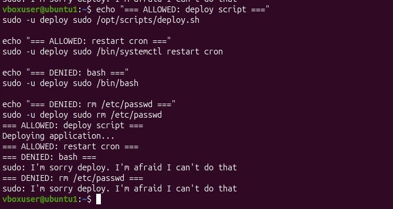

### Auth log entries

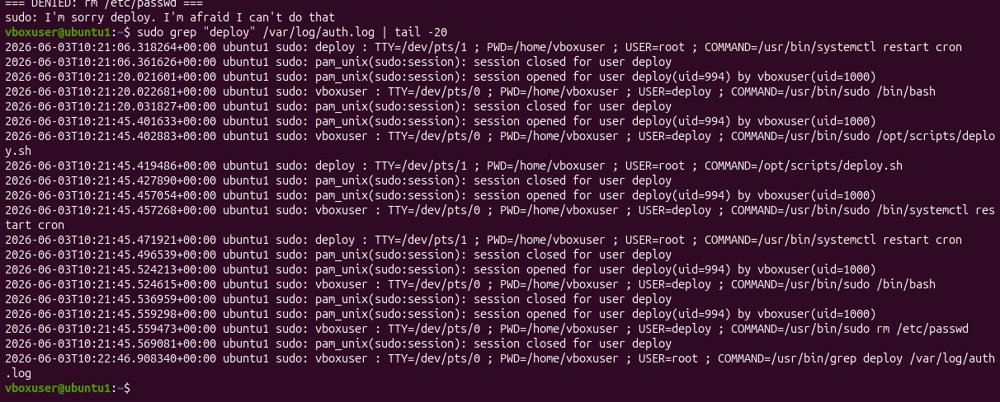

---

# Lab 07 — Incident Response and Account Containment

## Objective

The objective of this lab was to practice containment of a potentially compromised account without destroying evidence. The account `bob` was assumed to have a leaked password and elevated access through the `sudo` and `docker` groups.

## Commands Used

```bash
id bob

sudo usermod -L bob
sudo grep bob /etc/shadow

sudo pkill -u bob
who
ps aux | grep "^bob"

sudo gpasswd -d bob sudo
sudo gpasswd -d bob docker
id bob

last bob
sudo grep "bob" /var/log/auth.log | tail -50

sudo touch -d "1 hour ago" /tmp/marker
sudo find /home/bob -newer /tmp/marker -ls 2>/dev/null

sudo usermod -U bob
sudo passwd -e bob
sudo usermod -aG docker bob
id bob
```

## Incident Timeline

Security reported that Bob's password was found in a data breach, and Bob had elevated access through the `sudo` and `docker` groups. First, Bob's account was locked with `usermod -L bob` to prevent new password-based logins while preserving the account and evidence. The lock was verified by checking `/etc/shadow` and confirming the `!` prefix before the password hash. Next, Bob's active sessions and running processes were terminated with `pkill -u bob`, and the system was checked with `who` and `ps aux | grep "^bob"`. Elevated access was then revoked by removing Bob from the `sudo` and `docker` groups using `gpasswd -d`. After containment, login history was reviewed with `last bob`, sudo activity was searched in `/var/log/auth.log`, and recently modified files were investigated with `find`. During recovery, Bob's account was unlocked, his password was expired so he must reset it at next login, and only the `docker` group was restored according to least privilege.

If Bob had `NOPASSWD: ALL`, the worst-case impact would be full root compromise without a password prompt. An attacker using Bob's account could immediately run arbitrary commands as root, modify system files, create persistence, add privileged users, tamper with logs, access sensitive data, or disable security controls.

## Why Lock Instead of Delete

Deleting the account immediately could destroy useful evidence. File ownership records and logs may rely on the UID-to-username mapping. Locking the account preserves evidence while preventing new logins.

## Screenshots

### Bob locked in `/etc/shadow`

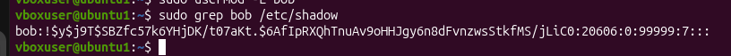

### Bob before containment with sudo and docker

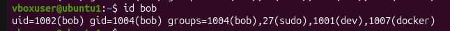

### Bob after group removal

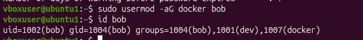

### Bob login history

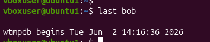

---

# Lab 08 — Surviving SSH Disconnections with `tmux`

## Objective

The objective of this lab was to learn how `tmux` keeps long-running terminal jobs alive even if an SSH connection or local terminal closes. The lab also introduced panes, windows, detach, reattach, and session renaming.

## Commands and Shortcuts

```bash
tmux new -s dataproc

for i in $(seq 1 300); do echo "Step $i of 300"; sleep 1; done

tmux ls
tmux attach -t dataproc
tmux rename-session lab08
```

Important shortcuts:

| Action                | Shortcut                 |
| --------------------- | ------------------------ |
| Detach                | `Ctrl+B`, then `D`       |
| Split pane vertically | `Ctrl+B`, then `%`       |
| Switch pane           | `Ctrl+B`, then arrow key |
| Zoom pane             | `Ctrl+B`, then `Z`       |
| New window            | `Ctrl+B`, then `C`       |
| Rename window         | `Ctrl+B`, then `,`       |
| Window list           | `Ctrl+B`, then `W`       |

## Real Scenario

A real scenario where `tmux` would help is when running a long installation, data-processing command, or security monitoring task over SSH. If the network disconnects, a normal foreground process may terminate. With `tmux`, the session continues running on the remote machine and can be reattached later.

## What Detach Means at the OS Level

At the OS level, detach means the local terminal disconnects from the `tmux` client, but the `tmux` server process and its child processes continue running on the server. Commands inside the `tmux` session are attached to pseudo-terminals managed by `tmux`, not directly to the SSH terminal. Reattaching connects a new terminal client back to the existing session.

## Screenshots

### Session alive after detach

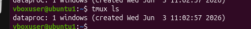

### Two panes: counter and `top`

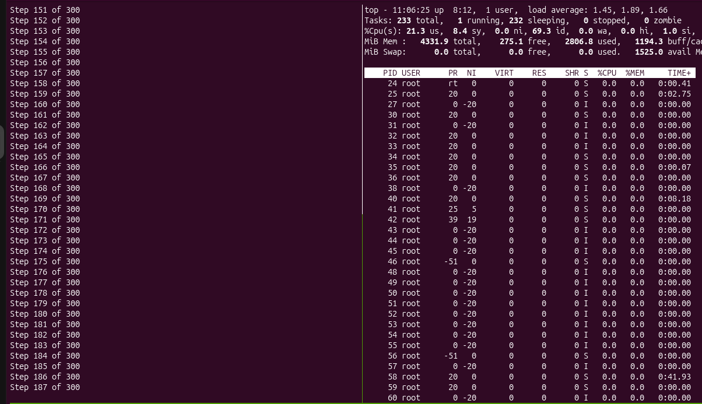

### Window list with monitor window

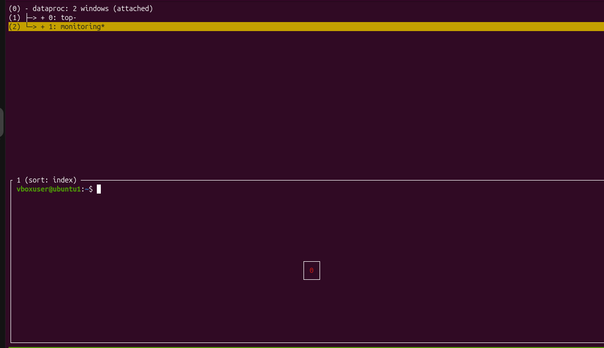

---

# Lab 09 — Process Diagnosis and Control

## Objective

The objective of this lab was to identify a runaway CPU process, inspect it, reduce its priority, and terminate it safely using signal escalation. The lab also practiced shell job control with `jobs`, `fg`, `bg`, and job-number killing.

## Commands Used

```bash
python3 -c "while True: pass" &

top

ps -p 41984 -o pid,comm,user,pcpu,pmem,nice,etime

renice -n 19 -p 41984

kill 41984
sleep 3
ps -p 41984
kill -9 41984

sleep 999 &
jobs
fg %1
# Ctrl+Z
bg %1
kill %1
```

## Signals

| Signal    | Number | Meaning                      | Use Case                                          |
| --------- | -----: | ---------------------------- | ------------------------------------------------- |
| `SIGHUP`  |      1 | Hangup or reload request     | Often used to ask daemons to reload configuration |
| `SIGTERM` |     15 | Polite termination request   | Normal first step to stop a process               |
| `SIGKILL` |      9 | Immediate forced termination | Last resort when a process refuses to stop        |
| `SIGSTOP` |     19 | Pause process immediately    | Freeze a process without killing it               |
| `SIGCONT` |     18 | Continue stopped process     | Resume a stopped process                          |

## Why `kill -9` Is Last Resort

`kill -9` sends `SIGKILL`, which cannot be caught or ignored. The process has no chance to clean up, close files, finish writes, or release resources gracefully. This can corrupt data if used on databases, file synchronization tools, or services writing important data. Therefore, the safer order is to inspect the process, optionally reduce priority with `renice`, try `SIGTERM`, wait, and use `SIGKILL` only if necessary.

## Screenshots

### Python CPU hog before renice, NI = 0

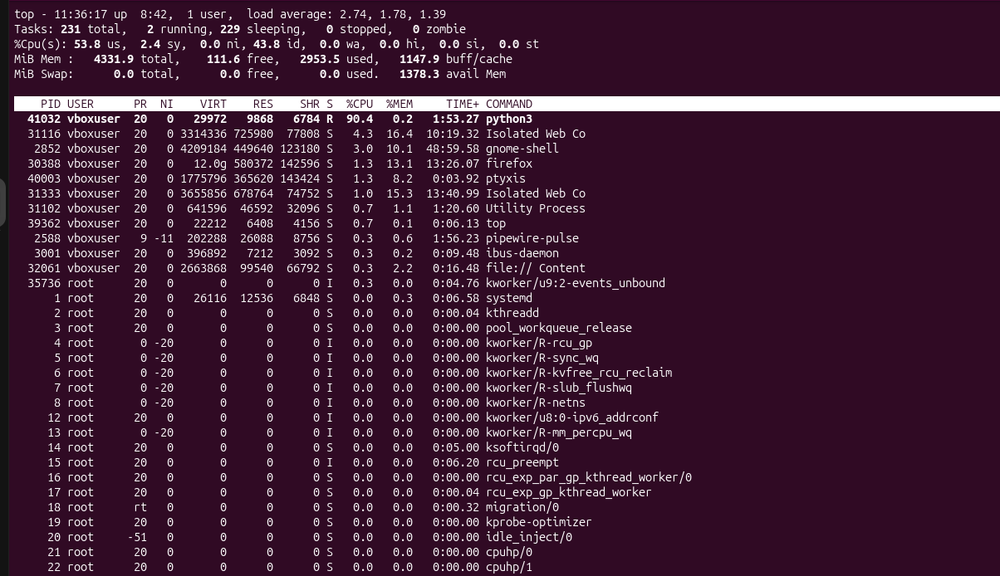

### Python process after renice, NI = 19

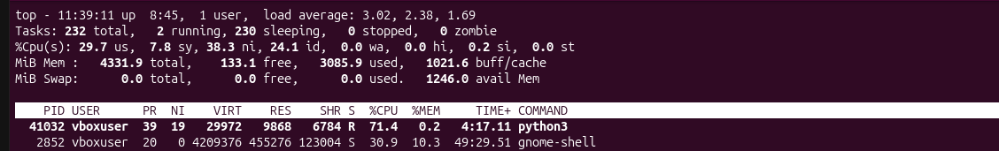

### Job control cycle

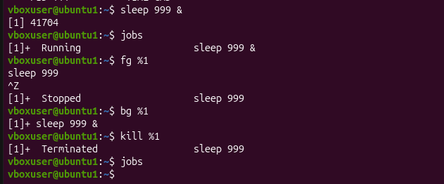

---

# Lab 10 — Capstone: Hardened Multi-Role Development Server

## Objective

The objective of this capstone was to combine all previous concepts into a complete hardened Linux server design. The server supports four roles: developers, operations, CI runner, and auditors.

## Users and Groups

| User       | Role                  | Groups                       |
| ---------- | --------------------- | ---------------------------- |
| `alice`    | Developer             | `devs`                       |
| `carol`    | Operations            | `ops`                        |
| `eve`      | Auditor               | `auditors`                   |
| `cirunner` | CI automation account | `devs`, system user, nologin |

The `cirunner` account was created as a system user with `/usr/sbin/nologin` because it is intended for automation, not interactive human login. This reduces attack surface while still allowing controlled sudo execution for specific automation tasks.

## Directory Design

### `/opt/appdata`

```text
Owner: root:devs
Mode: 2770
```

This means SGID is enabled and the `devs` group has full access. New files inherit the `devs` group. ACLs allow `ops` and `auditors` to read and traverse the directory without writing.

### `/var/log/applog`

```text
Owner: root:ops
Mode: 750
```

The `ops` group owns the log directory. ACLs allow `devs` to write log entries and auditors to read logs only. The `cirunner` account, as a member of `devs`, can write a log entry.

## Sudo Policy

Sudo rules were separated into `/etc/sudoers.d/` files:

```sudoers
%devs ALL=(root) /opt/scripts/deploy.sh
%ops ALL=(root) /bin/systemctl status cron
cirunner ALL=(root) NOPASSWD: /opt/scripts/deploy.sh
```

If the system uses `/usr/bin/systemctl`, the `ops` rule should use:

```sudoers
%ops ALL=(root) /usr/bin/systemctl status cron
```

Auditors were intentionally given no sudo access.

## Permission Summary Table

| User       | Groups     | `/opt/appdata`              | `/var/log/applog`    | Sudo Rights                                |
| ---------- | ---------- | --------------------------- | -------------------- | ------------------------------------------ |
| `alice`    | `devs`     | read/write/execute          | write via `devs` ACL | Can run `/opt/scripts/deploy.sh`           |
| `carol`    | `ops`      | read/execute only           | read/execute as ops  | Can run `systemctl status cron` only       |
| `eve`      | `auditors` | read/execute only, no write | read-only, no write  | No sudo rights                             |
| `cirunner` | `devs`     | read/write/execute          | write via `devs` ACL | NOPASSWD for `/opt/scripts/deploy.sh` only |

## Design Write-Up

This server was designed using role-based access control and the principle of least privilege. Developers receive write access to application data and the ability to run only the deploy script. Ops users receive read access to the project directory and operational log access but no ability to modify application data. Auditors receive read-only access and no sudo rights, preventing them from modifying the system while still allowing review. The `/opt/appdata` directory uses SGID so new files inherit the `devs` group, and ACLs provide additional read-only access for `ops` and `auditors`. The `/var/log/applog` directory is owned by `root:ops`, with ACLs granting `devs` write access and auditors read-only access. The CI runner is a system user with `nologin` because it is an automation identity, not a human login account. Sudo rules are stored in separate `/etc/sudoers.d/` files to keep privilege rules modular and auditable. The CI runner receives `NOPASSWD` only for the deploy script, not for arbitrary commands. Security audit checks confirmed that only root has UID 0, no unexpected world-writable files exist under `/opt`, and no unexpected SUID files were created. This configuration applies least privilege across users, groups, files, ACLs, sudo, and process execution.

## Screenshots

### User and group membership / access verification

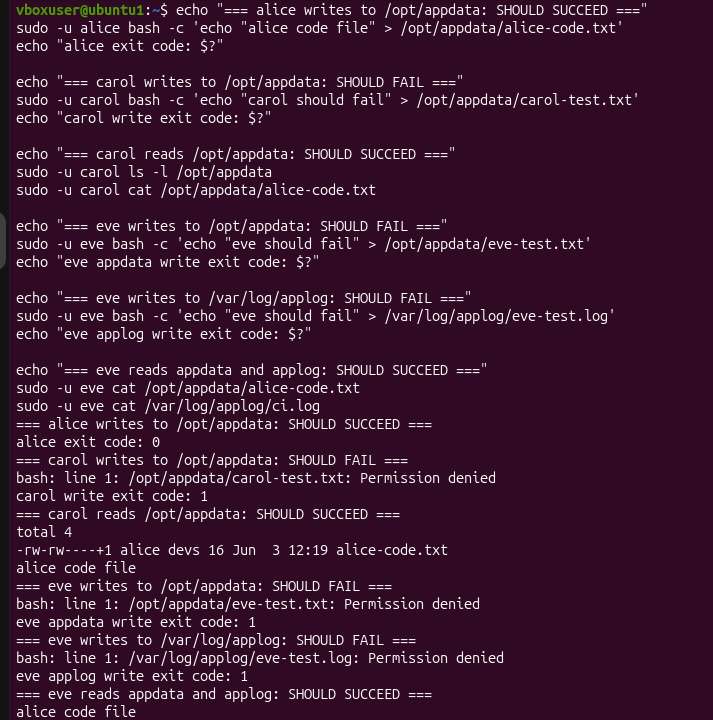

### ACL setup for `/opt/appdata` and `/var/log/applog`

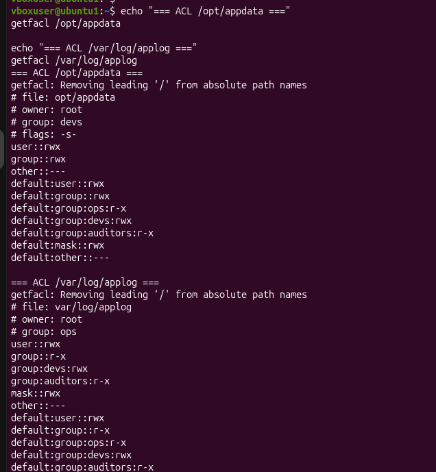

### Security audit clean results

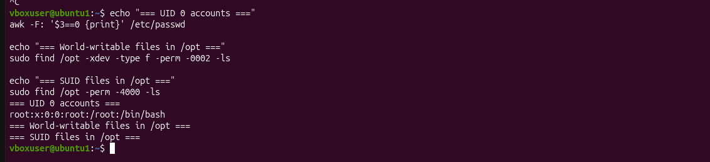

### Sudo tests — roles allowed and denied 1

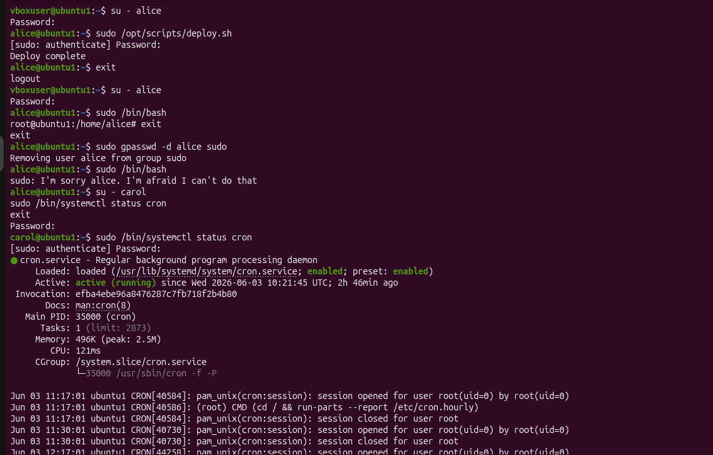

### Sudo tests — roles allowed and denied 2

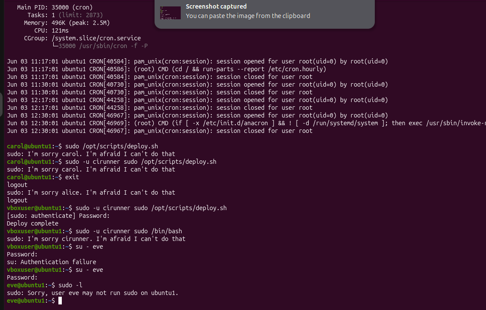

---

# Conclusion

Across these labs, I practiced core Linux administration and security concepts: user and group management, permission bits, ownership, `umask`, SGID, sticky bit, ACLs, sudoers policy, account containment, terminal persistence with `tmux`, process management, and server hardening. The most important principle throughout the module is least privilege. Users and service accounts should receive only the access they need, and every elevated command should be specific, auditable, and justified. The capstone combines these concepts into a complete multi-role Linux server design that separates developers, operators, auditors, and automation accounts while preserving security and operational functionality.
